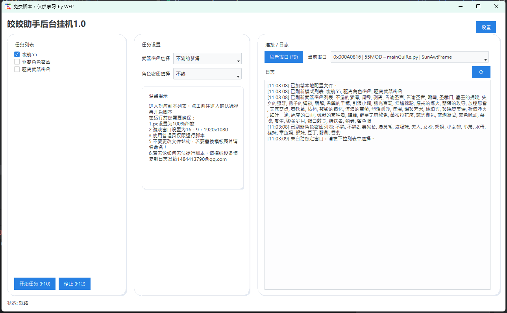

# 皎皎助手 - 二重螺旋后台挂机脚本

⚠️ 本脚本基于 pywin32 调用 Windows API 执行截图与输入操作，无内存注入等高危操作！⚠️ 

~~偶遇超级技术难题拼尽全力无法解决，无尽模式伦次结束后的“撤离”与“再次挑战”按键无法通过sendmessge或postmessge点击，此二个按键可能是隐藏的子弹窗或子控键，按钮的点击处理可能只在特定层级/特定控件上生效，或者控件依赖前置焦点/捕获/前台链路，通过ChildWindowFromPointEx递归子链也无法输入点击，如有解决方案可以发送至1484413790@qq.com，万分感谢~~

上述问题已解决，通过CHELItest.py中的find_deepest_child_at_screen_point方法，使用win32gui.ChildWindowFromPointEx遍历最深子控键，就可以找到“撤离”与“再次挑战”的真实位置并输入信号，可喜可贺！！


# 环境准备
```powershell
# 安装所需依赖库
pip install -r requirements.txt
运行脚本
powershell
# 启动主程序
python main.py
```

```markdown
## 项目目录结构
- jiaojiao/  # 根目录
  - control/  # 按键模板图
    - json/  # 移动序列文件目录
      - 55mod/
      - juesemihan/
      - wuqimihan/
  - logic/  # 各模式循环逻辑
    - 55mod.py
    - juesemihan.py
    - wuqimihan.py
  - map/  # 地图资源目录
    - 55mod/
    - juesemihan/
    - wuqimihan/
  - config.json  # 用户设置保存文件
  - jsontest.py  # JSON操作序列测试用
  - main.py  # 主程序入口
  - recorder.py  # 操作录制器
  - test.py  # 非焦点窗口截图测试脚本
  - test2.py  # 非焦点窗口输入操作测试脚本
```

# 功能说明

当前已实现功能：
55 夜航模式挂机
驱离武器密函模式挂机

# 可能遇到的问题
Q:地图，按键等识别失败。
 A:由于每个设备的分辨率等不同，若脚本一直无法识别按键和地图，你可能需要更换./map和./control的特征图，请检查游戏内设置：设定16：9，1920x1080，清晰度中或高。PC设备设置：缩放100%

Q：脚本运行后无反应。
 A：请使用管理员模式开启

Q：不是以上问题，就是运行不了。
 A：请描述问题，发送日志并标明来意至：1484413790@qq.com

# ToDo
扩展更多游戏内模式支持.

~~优化图像识别逻辑，提升成功率.~~

增强失败补救机制（如重新点击、退出重开等).

增加自定义快捷键功能.支持组合键操作（如一键螺旋飞跃二段跳冲刺快速跑图，一键复位等）.

~~优化Gui界面，提升人性化体验.~~

增加各种抖动之类的安全防检测措施


# 免责声明
本 "二重螺旋" 游戏脚本（以下简称 "本脚本"）仅为学习和研究目的而开发，开源且免费提供，作者不对使用本脚本可能产生的任何直接或间接后果承担责任。
使用条款

本脚本的使用应遵守游戏官方的用户协议及相关规定，禁止用于任何违反游戏规则、破坏游戏公平性或侵犯游戏运营商权益的行为。

使用者应确保在合法合规的前提下使用本脚本，不得利用本脚本从事任何违法活动或侵犯第三方合法权益。

本脚本仅提供技术实现示例，作者不对其适用性、准确性、完整性或可靠性做出任何明示或暗示的保证。

因使用本脚本而导致的任何游戏账号处罚、数据丢失、设备损坏或其他损失，作者不承担任何责任。

使用者应自行承担使用本脚本所产生的一切风险和后果。

本脚本的代码完全开源，使用者可进行修改、分发，但需保留原作者的免责声明及相关版权信息。

使用本脚本，即表示您已阅读并同意本免责声明的全部内容。


# 更新日志

2025.7.11
使用ttkbootstrap优化了界面gui，以圆角卡片形式分布功能

优化了日志文本，增加emoji更好理解

优化了recorder，可以手动选择地图模板图和json保存位置

优化了地图识别逻辑，删除所有阈值限制，三特征匹配并把三特征置信度相加选最高者，这样调整之后地图识别成功率很高且不怎么误判，如果长期测试后还是会出现误判问题，考虑增加roi蒙版🤔

解决了部分按键的无法后台点击问题，通过深度子控键遍历，添加了CHILItest.py用于测试用例和实现代码留存。
